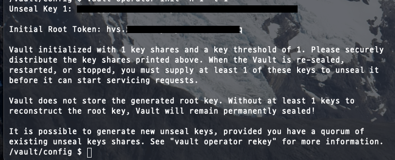
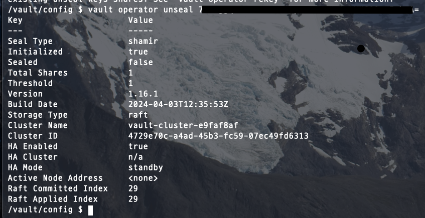
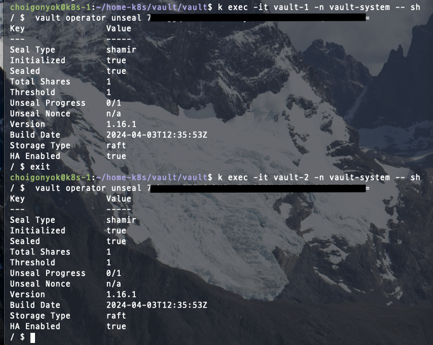
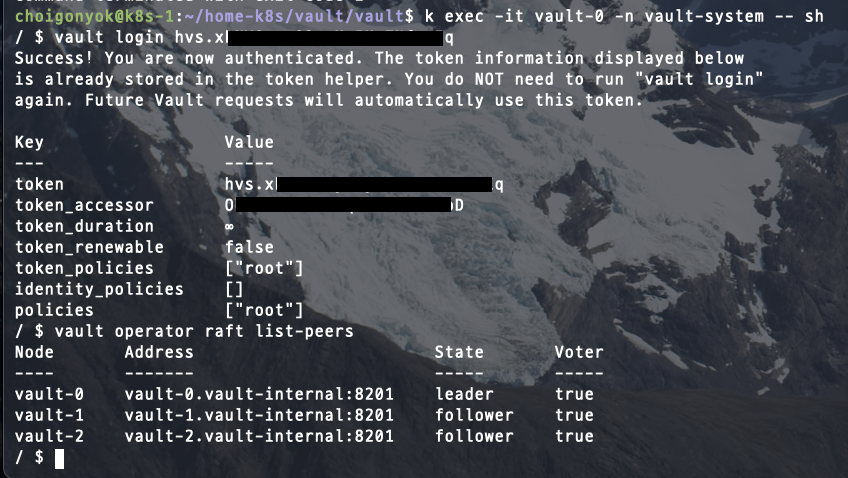

# vault server 

vault는 처음 seal을 하면 그게 active 서버가 된다
seal은 vault operator init -n 1 -t 1

루트 토큰과 key가 나오고 키로 unseal

vault operator unseal KEY

같은 키로 다른 서버들도 unseal

vault login ROOT_TOKEN으로 로그인해주고,

vault operator raft list-peers 커맨드로 ha 구성 확인 가능

## 정책 적용 role/token 생성 및 시크릿 ui 생성/접근

